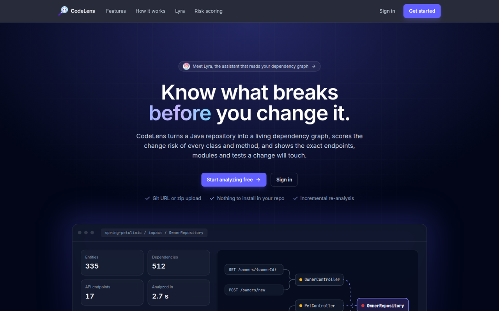
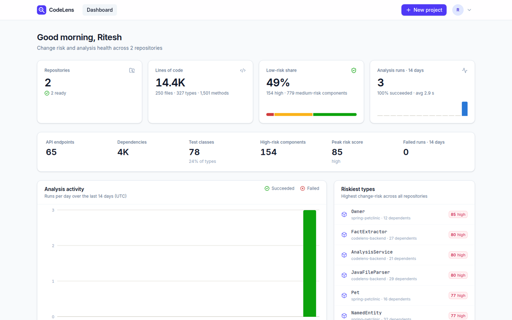
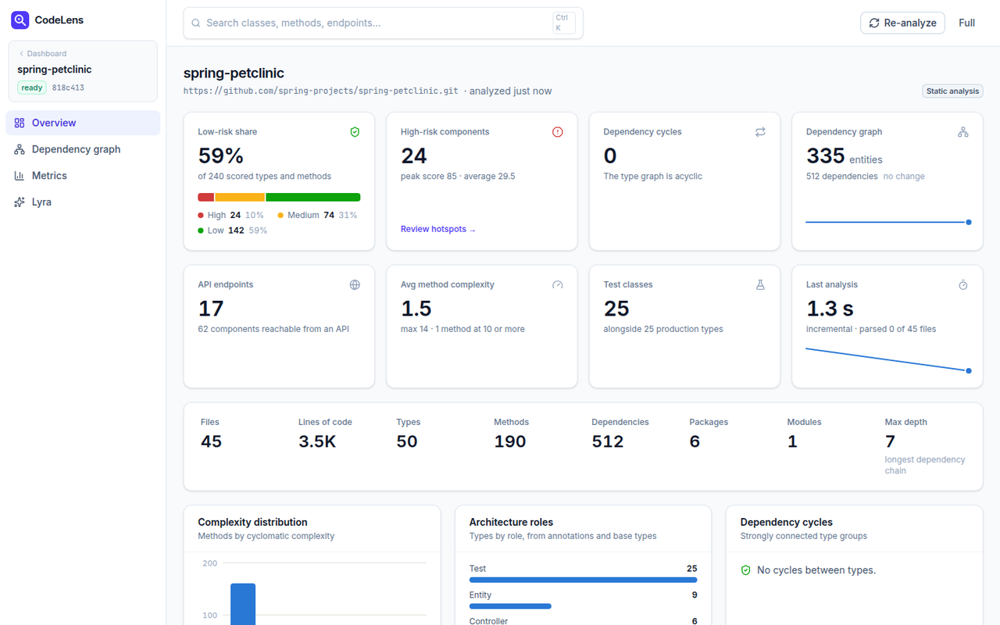
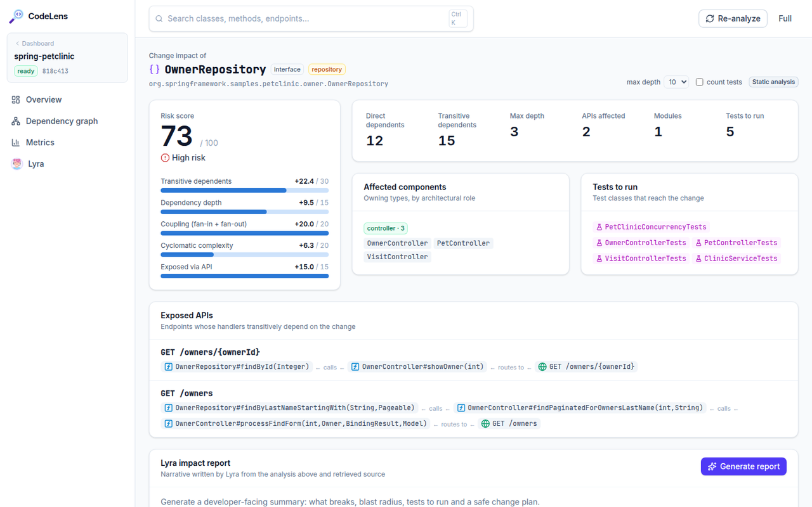
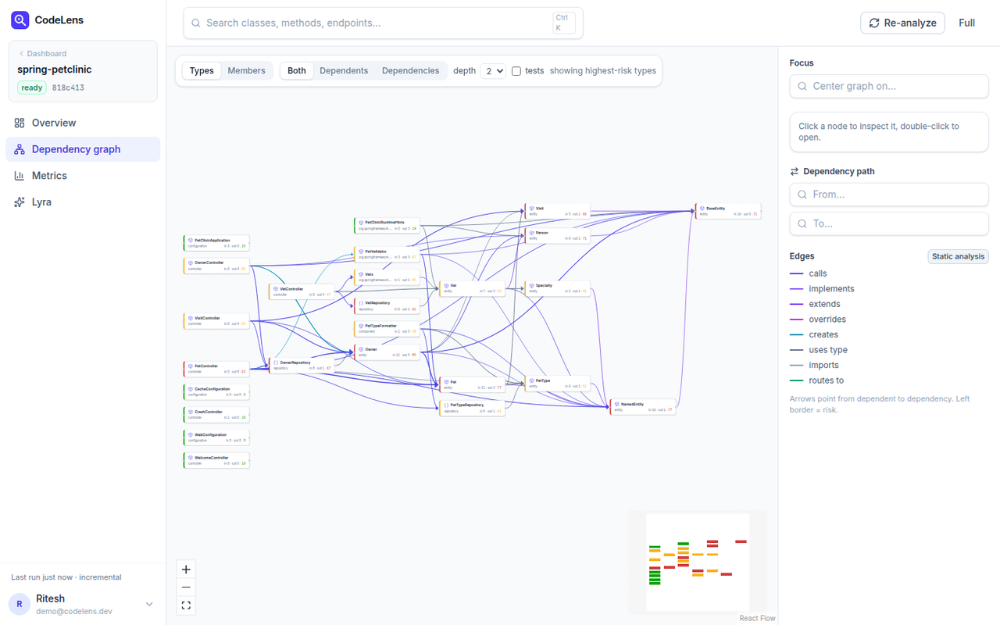
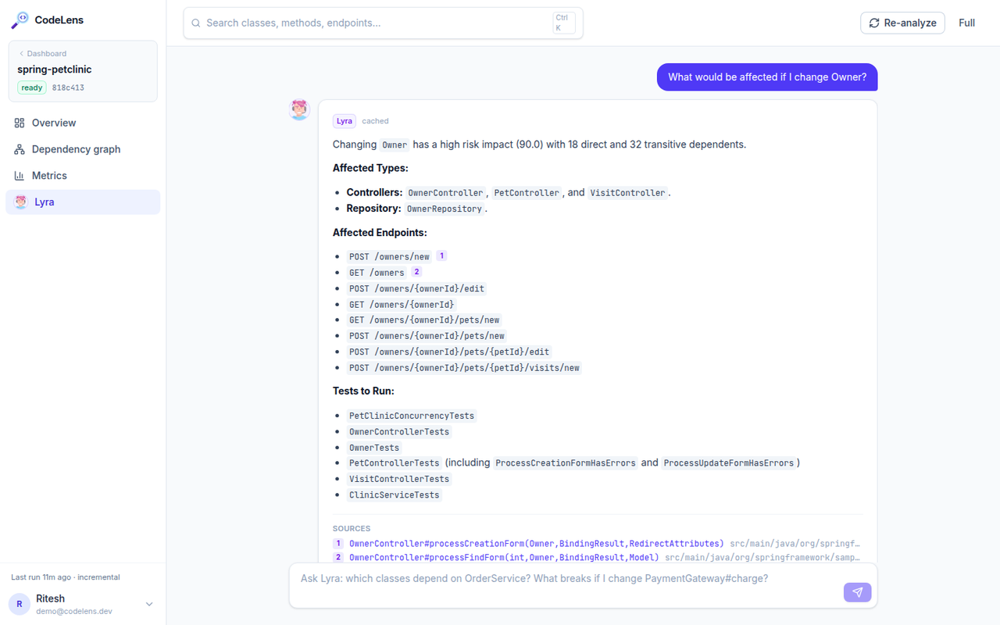
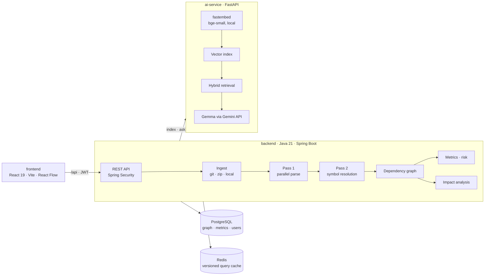
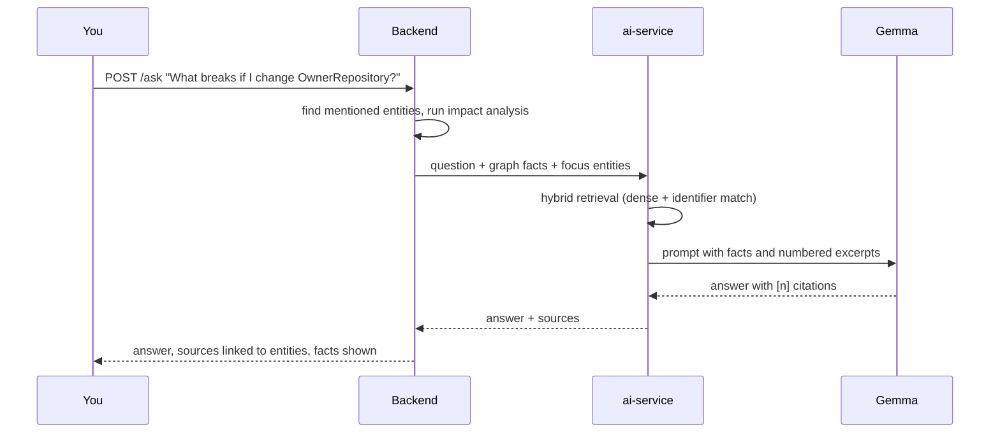

<div align="center">


# CodeLens

**Know what breaks before you change it.**

Code intelligence and change-impact analysis for Java repositories, with **Lyra**, an AI assistant grounded in your dependency graph.


[Features](#features) · [Screenshots](#screenshots) · [Architecture](#architecture) · [Quick start](#quick-start) · [Configuration](#configuration) · [API](#api) · [Testing](#testing)

</div>

---

## Overview

Most regressions from a refactor are not in the lines you touched. They are in the code that quietly depends on them.

CodeLens parses a Java repository into a typed dependency graph of classes, methods, fields and HTTP endpoints. It then:

- scores the change risk of every component;
- shows the exact endpoints, modules and tests a change reaches;
- answers questions about the codebase through **Lyra**.

**Static analysis does the heavy lifting.** It is deterministic, and Lyra only explains facts it is given. Every AI answer in the UI is labelled as such and shows the graph facts and source excerpts behind it.

## Features

| | Feature | What you get |
|---|---|---|
| 🧭 | **Dependency graph** | Two-pass JavaParser analysis: `CALLS`, `EXTENDS`, `IMPLEMENTS`, `OVERRIDES`, `CREATES`, `USES_TYPE`, `IMPORTS`, `ANNOTATED_BY`, `ROUTES_TO`. Interactive graph with a path finder. |
| 🎯 | **Change impact** | Direct and transitive dependents, following interface dispatch. Also shows affected endpoints, roles, modules and tests, plus the path that explains each hit. |
| 📊 | **Explainable risk** | 0–100 score per type and method from five published, weighted factors. |
| ⚡ | **Incremental analysis** | Files are diffed by SHA-256. Only changed files are re-parsed, their dependents are re-resolved, and the database is patched in place. |
| 🏛️ | **Architecture metrics** | Fan-in/out, depth, cyclomatic complexity, Tarjan cycle detection, and Martin's Ca, Ce, instability, abstractness and distance per package and module. |
|  | **Lyra assistant** | Hybrid RAG over locally embedded code, grounded in graph facts. Answers carry numbered citations, and you can generate stored impact reports. |
| 📈 | **KPI dashboards** | A portfolio view (risk mix, run activity, riskiest types) and a per-project view (low-risk share, cycles, complexity distribution, run trends). |
| 🔐 | **Accounts** | Sign up and sign in with JWT bearer tokens and BCrypt passwords. Projects are private to their owner. |
| 📦 | **Flexible ingestion** | Git URL (shallow clone, fast pull), zip upload (zip-slip safe) or a local directory. |

## Screenshots

| Landing page | Portfolio dashboard |
|---|---|
|  |  |
| **Project KPIs** | **Change impact** |
|  |  |
| **Dependency graph** | **Lyra** |
|  |  |

## Architecture



**Analysis pipeline**
1. Scan the sources.
2. Parse files in parallel with a thread-local JavaParser (pass 1).
3. Resolve symbols across the project into entities and edges (pass 2).
4. Bulk write with JDBC batching.
5. Load an immutable, index-based graph.
6. Compute metrics and risk.
7. Publish an event, and the ai-service indexes code chunks for Lyra.

**How Lyra answers a question**



### Risk model

```
risk = 100 × (0.30·dependents + 0.15·depth + 0.20·coupling + 0.20·complexity + 0.15·exposed)
```

Each factor is log-normalised against the project maximum. Levels: **HIGH ≥ 60**, **MEDIUM ≥ 30**, otherwise **LOW**.

## Tech stack

| Layer | Technology |
|---|---|
| Analysis engine | Java 21, Spring Boot 3.3, JavaParser 3.26, JGit, virtual threads |
| Security | Spring Security, OAuth2 resource server (HS256 JWT), BCrypt |
| Storage | PostgreSQL 16 with Flyway migrations, Redis 7 cache keyed by graph version |
| AI service | Python 3.12, FastAPI, fastembed (`bge-small-en-v1.5`), NumPy vector index |
| LLM | `gemma-4-26b-a4b-it` with `gemini-2.5-flash-lite` fallback, rate-limited and disk-cached |
| Frontend | React 19, Vite, TypeScript, Tailwind CSS v4, React Flow, dagre, TanStack Query |
| Delivery | Docker multi-stage images, Docker Compose, nginx, Makefile |

## Quick start

### Prerequisites

- Docker with Compose v2
- For local development: Java 21, Node 20+ and Python 3.12
- A [Gemini API key](https://aistudio.google.com/apikey); the free tier is enough. Static analysis works without one.

### Run everything with Docker

```bash
git clone <repository-url> codelens && cd codelens
make env                  # creates backend/.env, ai-service/.env, frontend/.env
# add GEMINI_API_KEY to ai-service/.env and a JWT_SECRET to backend/.env
make prod-up
```

Open **http://localhost:5173**, create an account, and analyze a repository. For example, try `https://github.com/spring-projects/spring-petclinic.git`.

### Local development

```bash
make install              # maven deps, python venv, npm packages
make dev                  # postgres + redis in docker; backend :8090, ai-service :8000, frontend :5173
```

Run `make help` to list every target (`infra-up`, `infra-down`, `test`, `prod-logs`, `clean`, ...). The interactive API docs are at http://localhost:8090/swagger-ui.html; use **Authorize** with a token from `/api/auth/login`.

## Configuration

Each service reads its own `.env`, and a committed `.env.example` sits beside it.

<details>
<summary><b>backend/.env</b></summary>

| Variable | Default | Description |
|---|---|---|
| `SERVER_PORT` | `8090` | HTTP port |
| `POSTGRES_DB` / `POSTGRES_USER` / `POSTGRES_PASSWORD` | `codelens` | Database credentials, shared with the postgres container |
| `DB_HOST` / `DB_PORT` | `localhost` / `5432` | Database address |
| `REDIS_HOST` / `REDIS_PORT` | `localhost` / `6379` | Cache address |
| `AI_SERVICE_URL` | `http://localhost:8000` | ai-service base URL |
| `REPOS_DIR` | `./data/repos` | Clones, uploads and parse cache |
| `JWT_SECRET` | *(random per start)* | HS256 signing key, at least 32 bytes (`openssl rand -base64 48`) |
| `ALLOW_LOCAL_PATHS` | `true` | Allow local directories and `file:` git URLs. Docker sets `false`. |

</details>

<details>
<summary><b>ai-service/.env</b></summary>

| Variable | Default | Description |
|---|---|---|
| `GEMINI_API_KEY` | - | Required for Lyra answers and reports |
| `GEMINI_MODEL` | `gemma-4-26b-a4b-it` | Primary model |
| `GEMINI_FALLBACK_MODEL` | `gemini-2.5-flash-lite` | Used when the primary fails |
| `EMBED_PROVIDER` | `local` | `local` (fastembed) or `gemini` |
| `LLM_RPM` / `EMBED_RPM` | `20` / `60` | Client-side rate limits |
| `MAX_CONTEXT_CHARS` | `24000` | Prompt budget |
| `MAX_OUTPUT_TOKENS` | `8192` | Includes Gemma's thinking tokens |
| `DATA_DIR` | `./data` | Vector index and answer cache |

</details>

<details>
<summary><b>frontend/.env</b></summary>

| Variable | Default | Description |
|---|---|---|
| `VITE_API_URL` | `http://localhost:8090` | Backend target for the dev proxy |

</details>

## API

All endpoints except auth, config and health need `Authorization: Bearer <token>`. Project routes return `404` for projects owned by someone else. Errors use RFC 7807 problem details.

| Area | Endpoints |
|---|---|
| Auth | `POST /api/auth/register` · `POST /api/auth/login` · `GET /api/auth/me` · `GET /api/config` |
| Dashboard | `GET /api/dashboard` |
| Projects | `GET·POST /api/projects` · `POST /api/projects/upload` · `GET·DELETE /api/projects/{id}` · `POST /api/projects/{id}/analyze?mode=FULL\|INCREMENTAL` · `GET /api/projects/{id}/runs` |
| Entities | `GET …/{id}/entities/search?q=` · `GET …/entities/{entityId}` · `GET …/entities/{entityId}/source` |
| Graph | `GET …/{id}/graph` · `GET …/graph/path?from=&to=` · `GET …/graph/cycles` |
| Impact | `GET …/{id}/impact/{entityId}` · `GET …/impact/file?path=` |
| Metrics | `GET …/{id}/overview` · `GET …/metrics/hotspots` · `GET …/metrics/modules` |
| Lyra | `POST …/{id}/ask` · `POST …/reports/impact/{entityId}` · `GET …/reports` · `POST …/ai/reindex` · `GET …/ai/status` |

```bash
TOKEN=$(curl -s localhost:8090/api/auth/login -H 'Content-Type: application/json' \
  -d '{"email":"you@example.com","password":"your-password"}' | jq -r .token)
curl -s localhost:8090/api/dashboard -H "Authorization: Bearer $TOKEN" | jq .totals
```

## Project structure

```
codelens/
├── backend/                 Spring Boot analysis engine and REST API
│   └── src/main/java/com/codelens/
│       ├── api/             controllers and DTOs
│       ├── auth/            JWT issuing, current user, project ownership guard
│       ├── parser/          two-pass JavaParser analysis
│       ├── graph/           immutable graph, traversal, cycles, roll-up
│       ├── metrics/         coupling, depth, risk scoring
│       ├── impact/          change impact analysis
│       ├── ingest/          git, zip, local scanning, parse cache
│       ├── ai/              ai-service client, chunking, indexing, ask, reports
│       └── service/         analysis orchestration, queries, dashboard
├── ai-service/              FastAPI RAG service (embeddings, retrieval, Gemini client)
├── frontend/                React dashboard, landing page and Lyra UI
├── docs/                    README assets and screenshots
├── docker-compose.yml       production stack
├── docker-compose.dev.yml   postgres + redis for local development
└── Makefile                 dev, test and docker shortcuts
```

## Testing

```bash
make test            # everything
make test-backend    # JUnit 5 + Testcontainers (PostgreSQL, Redis) and a fake AI service
make test-ai         # pytest with fake embedder and mocked Gemini transport
make test-frontend   # type-check and production build
```

The backend integration tests cover parsing, the graph, metrics, impact, incremental runs, caching, auth and cross-account isolation. They need Docker but no API key.

## Security

- Passwords are hashed with BCrypt. Login compares against a dummy hash for unknown emails, so response timing does not reveal accounts.
- Tokens are stateless HS256 JWTs. Set `JWT_SECRET` in production.
- An interceptor checks project ownership before any controller or cache lookup runs.
- Local-path ingestion can be switched off (`ALLOW_LOCAL_PATHS=false`), as it is in Docker. Zip extraction rejects path traversal.
- Only the frontend (`5173`) and API (`8090`) publish host ports. Containers run as non-root users.

## Free-tier friendly

- Embeddings run locally, so indexing never calls the Gemini API.
- Client-side rate limiting, a disk cache of answers, retries with backoff and a fallback model.
- Prompts are capped (`MAX_CONTEXT_CHARS`) and only built on explicit ask and report requests.

## Known limitations

- Calls into external libraries are not resolved, so third-party types appear only as imports.
- Overloads with the same number of arguments are all linked. This over-reports impact rather than missing it.
- Graphs are cached in memory per backend instance; horizontal scaling would need a shared graph store.
- The session token is kept in `localStorage`. Swapping to an httpOnly cookie is a contained change in `api/client.ts` and `SecurityConfig`.
